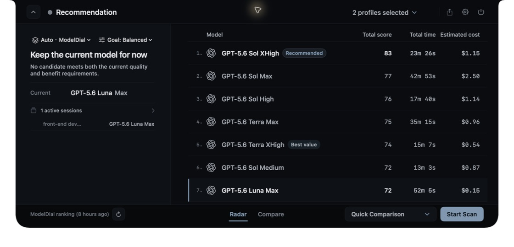

# ModelDial

[中文 README](README.md)

ModelDial is a local-first macOS menu bar app for comparing real `model + effort + route` configurations. It runs a repeatable coding evaluation and keeps quality, elapsed time, token, and reference-cost evidence so you can choose a practical model configuration for each task.

> This repository is an auditable public-source candidate. No formally signed download package is available yet; source builds use ad-hoc signing by default. A paid Apple Developer Program membership is not required for the `v0.1.0-preview.1` preview, but that preview is **unsigned / unnotarized** and is not Apple-notarized or Gatekeeper-approved.

## Download channels and installation

- Product website: <https://modeldial.com>
- A formally signed DMG is not available yet. The formal release will be published through GitHub Releases only after Developer ID signing, Apple notarization, and clean-machine acceptance are complete.
- The staged preview uses GitHub Release `v0.1.0-preview.1` and targets macOS 13+ on Apple Silicon; Intel Macs are not currently supported. Preview assets must retain the `preview.1` label, must not use formal-release filenames, and must not claim signing, notarization, or ordinary first-launch success by double-click.

### Unpaid preview (unsigned / unnotarized)

Download these assets from [GitHub Release `v0.1.0-preview.1`](https://github.com/tianwdong/modeldial/releases/tag/v0.1.0-preview.1) and verify them against `SHA256SUMS` from the same release:

- `modeldial-0.1.0-preview.1-macos-arm64.dmg`
- `modeldial-0.1.0-preview.1-build-100-macos-arm64.zip`
- `SHA256SUMS`
- `modeldial-0.1.0-preview.1-sbom.spdx.json`

Installation steps:

1. Open the DMG, drag `modeldial.app` to `Applications`, eject the DMG, and launch the copy from `Applications`.
2. If macOS blocks the first launch because the developer cannot be verified, dismiss the dialog and open **System Settings → Privacy & Security**.
3. In the Security section, find the message that ModelDial was blocked and click **Open Anyway**, then confirm the prompt; launch the copy in `Applications` again.
4. If **Open Anyway** is not shown, try opening the app once more and return to **Privacy & Security**. Wording can vary slightly across macOS point releases.

This uses macOS's per-app confirmation in System Settings. **Do not disable Gatekeeper**, and do not use `xattr -dr com.apple.quarantine`, `spctl --master-disable`, or other commands that bypass system security checks. The preview has no Developer ID signature or Apple notarization and cannot promise a direct first double-click launch on every Mac; stop and re-check the release assets and SHA-256 if the source cannot be verified.

### Formal signed release (later)

The formal release will use a separate version label and asset naming, and will complete Developer ID Application signing, secure timestamping, Apple notarization, stapling, and Gatekeeper acceptance before publication. Until then, do not treat `v0.1.0-preview.1` as a formal release or a local ad-hoc build as a notarized artifact.

## Product preview



*Sample data; this is not a live leaderboard.*

- [Compare view: current and candidate configurations](docs/screenshots/modeldial-compare-en.jpg)
- [Scan settings: question count, parallelism, timeout, and retry](docs/screenshots/modeldial-settings-scan-en.jpg)
- [General settings: language and launch preferences](docs/screenshots/modeldial-settings-general-en.jpg)

## Core capabilities and workflow

- Compare real `model + effort + route` combinations instead of comparing model names alone.
- The authoritative source for the versioned question pack and evaluation profiles is [`questions/catalog.json`](questions/catalog.json); `quick` and `full` currently cover all enabled questions.
- Preserve quality, latency, token, reference-cost, failure, and per-question evidence for Radar, comparison, history, and export views.
- Observe local Codex, Claude Code, and Grok Build sessions, and configure compatible model endpoints.
- Local-first by default: no built-in telemetry and no session transcript upload. The website, Cloudflare Worker, remote evaluation runner, and snapshot publisher are outside this repository and are not App runtime entry points.

For a first run, launch the app and open its menu-bar icon. Go to **Evaluation → Connections** (中文为“评测 → 模型接入”), import a detected local provider or add an endpoint, choose the `quick` or `full` profile, then run a scan and inspect Radar, comparison, and history views.

If you installed the Codex or Claude Code session-observer hooks from source, this command removes only ModelDial's hooks and helper while preserving unrelated hooks:

```bash
python3 scripts/install_session_observer.py --uninstall
```

The macOS native menu-bar app is the only product runtime entry point. Other scripts and backend modules are called by the app or build scripts; they are not independent product entry points.

## Build and run

Source builds target macOS 13+ on Apple Silicon and require Xcode 16.4; no separate Python runtime installation is required. On the first `build.sh` run, [`python-runtime.lock.json`](build-support/python-runtime.lock.json) downloads the official python.org universal2 Python 3.14.3 installer, verifies its pinned SHA-256 and Python Software Foundation installer signature, and only extracts it under the ignored `build/` directory. It never performs a system installation or falls back to Homebrew or a Python found on `PATH`. The script then pins the versions and wheel SHA-256 values for PyInstaller 6.21.0, the certifi CA bundle, and their build dependencies in [`pyinstaller-requirements.txt`](build-support/pyinstaller-requirements.txt), installs them with `pip --require-hashes`, and uses a requirements-content receipt so an old environment cannot bypass a changed lock. Before signing, it exercises TLS, SHA-256, and zstd, requires a non-empty CA store, and recursively rejects Mach-O files whose minimum macOS version exceeds the App declaration or whose dynamic libraries use non-system absolute paths. [`package-unsigned-preview.sh`](build-support/package-unsigned-preview.sh) forces a fresh build and generates and verifies the DMG, ZIP, SPDX SBOM, and `SHA256SUMS`; these gates still do not replace clean-machine acceptance on macOS 13 and 14. SwiftPM also downloads the pinned Sparkle 2.9.4 dependency from `Package.resolved` on the first build.

```bash
./build.sh
open build/modeldial-candidate.app
```

`build.sh` builds the Swift app, freezes the Python backend, runs the snapshot smoke check, and verifies the signed bundle. It always preserves `build/modeldial.app` and normally writes the new build to `build/modeldial-candidate.app`; if that candidate is running, it uses a timestamped candidate path instead. Use the final path printed by the script. The app is a menu-bar app; open it from the menu-bar icon.

The open-source build uses ad-hoc signing by default; this is for local development and the unsigned preview only. It is not Developer ID or Apple notarization and does not make Gatekeeper trust the app. To use an installed signing identity:

```bash
MODELDIAL_CODESIGN_IDENTITY="Developer ID Application: ..." ./build.sh
```

For Swift or resource-only changes after one complete build:

```bash
./build-dev.sh
```

`build-dev.sh` first reuses the frozen Python backend from `build/modeldial-candidate.app`; if no candidate exists, it remains compatible with `build/modeldial.app`. Changes to `scanner/`, `scripts/`, or `questions/` require a fresh `./build.sh`.

Source builds leave the remote reference-snapshot URL empty, so local evaluation does not depend on the website or Cloudflare services. Set `MODELDIAL_REFERENCE_SNAPSHOT_URL` only when you have a real compatible public snapshot endpoint; the protocol is described in [`docs/architecture.md`](docs/architecture.md).

## Tests

Run the full Python regression suite:

```bash
python3 -m unittest discover -s tests -v
```

For changes to versioned DTO or architecture contracts, run the focused contract suite as well:

```bash
python3 -m unittest tests.test_architecture_baseline -v
```

Before submitting a change, check the diff formatting:

```bash
git diff --check
```

## Documentation

- [Open-source architecture boundary](docs/architecture.md): responsibilities between the App, scanner, and private services.
- [Benchmark and data distribution policy](docs/benchmark-and-data-policy.md): question packs, answer fixtures, pricing snapshots, and provider assets.
- [Open-source content audit](docs/open-source-content-audit.md): source, attribution, and question-pack search records.
- [Release checklist](docs/release-checklist.md): separate source-candidate and binary-release gates.
- [v0.1.0-preview.1 preview notes](docs/releases/v0.1.0-preview.1.md): unsigned/unnotarized GitHub Release assets, installation, and limitations.
- [Contributing](CONTRIBUTING.md): code boundaries and minimum verification.

## Data and network boundaries

ModelDial stores configuration, scan history, runtime state, and limited session metadata locally. API keys are stored in the macOS Keychain. During evaluation, synthetic questions and model responses pass through the local CLI or model service you select; those services retain their own terms and privacy policies. The App does not upload session transcripts or write credentials into scan history.

Source builds do not read a remote reference leaderboard unless the caller explicitly configures a compatible snapshot endpoint. See [PRIVACY.md](PRIVACY.md) for local data handling and [SECURITY.md](SECURITY.md) for private vulnerability reporting.

## Contributing and license

Read [CONTRIBUTING.md](CONTRIBUTING.md) before submitting changes. The source code is licensed under the [Apache License 2.0](LICENSE). The ModelDial name, logo, and app icon are brand assets and are not licensed as trademarks; see [TRADEMARKS.md](TRADEMARKS.md). Distributed third-party notices are in [NOTICE](NOTICE), [Resources/Legal/THIRD_PARTY_NOTICES.txt](Resources/Legal/THIRD_PARTY_NOTICES.txt), and [Resources/Legal/Sparkle-LICENSE.txt](Resources/Legal/Sparkle-LICENSE.txt).
