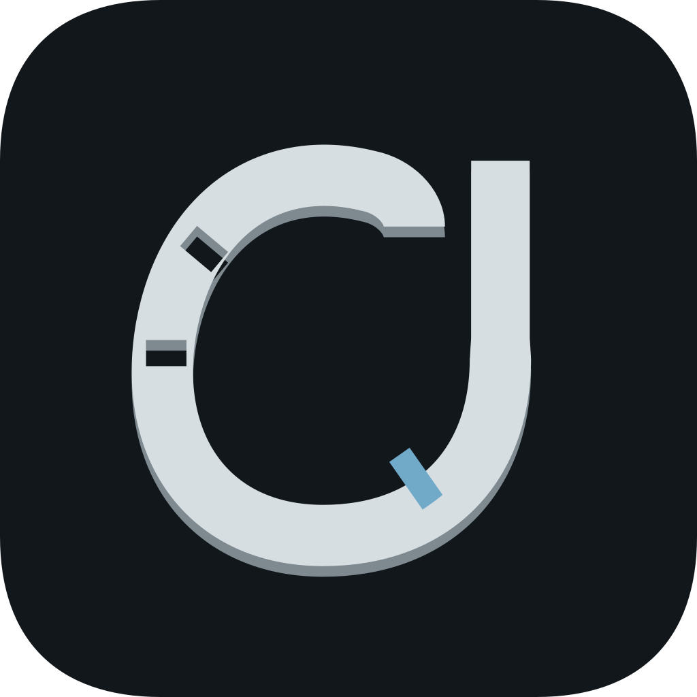
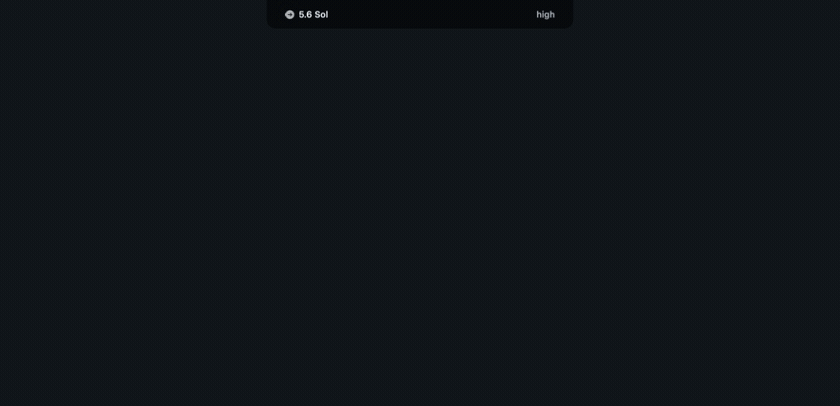
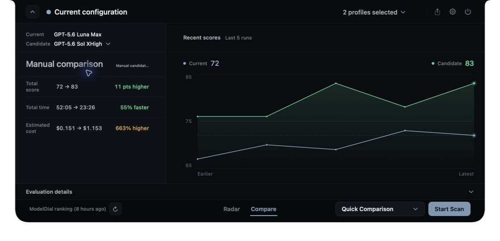
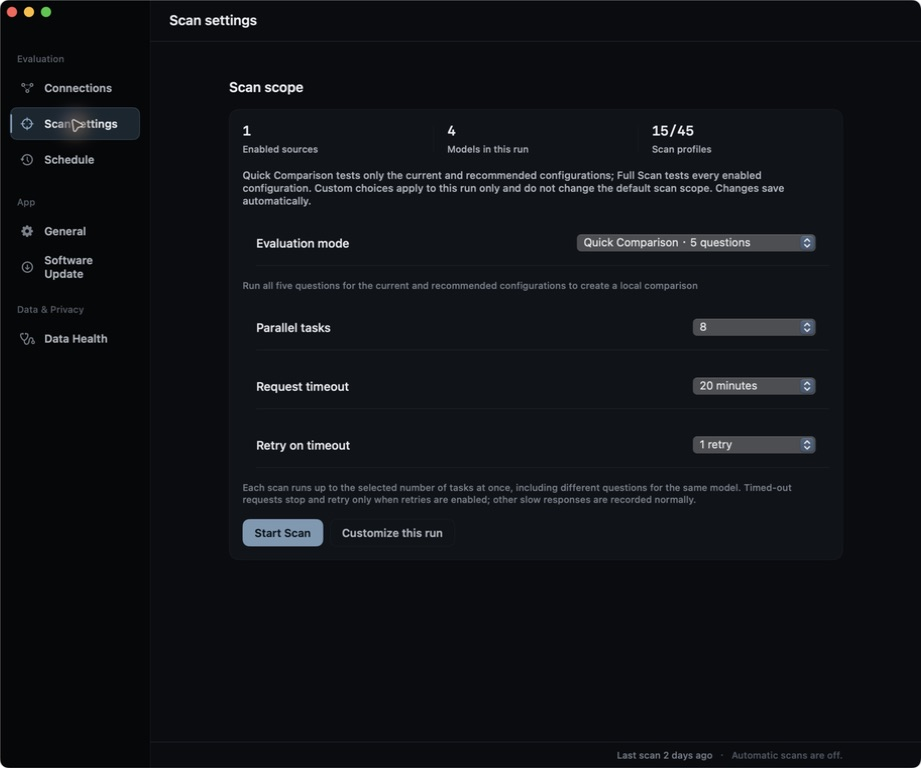

<div align="center">
  
  <h1>ModelDial</h1>
  <p><strong>Use real coding evaluations to choose a better-fit model configuration for each task.</strong></p>
  <p>Compare complete <code>model + effort + route</code> combinations across quality, speed, tokens, and reference cost.</p>
  <p>
    <a href="https://github.com/tianwdong/modeldial/releases/download/v0.1.0-preview.10/modeldial-0.1.0-preview.10-macos-arm64.dmg"><strong>Download the macOS preview</strong></a>
    · <a href="https://modeldial.com">Website</a>
    · <a href="https://modeldial.com/radar">Official Radar</a>
    · <a href="https://github.com/tianwdong/modeldial">GitHub</a>
    · <a href="README.md">简体中文</a>
  </p>
  <p><code>macOS 13+</code> · <code>Apple Silicon</code> · <code>local-first</code> · <code>no built-in telemetry</code></p>
</div>

<p align="center">
  
</p>

<p align="center"><em>Open official Radar and configuration comparison from the menu-bar capsule. Demo data is not a live leaderboard.</em></p>

## Browse Official Radar Without Setup

Open the app and click the ModelDial capsule in the menu bar to browse configuration results from scheduled first-party evaluations. It requires no API key and uses none of your model quota. You can also use the [web Radar](https://modeldial.com/radar) without installing the app.

Connect a local Codex, Claude Code, or Grok Build provider—or a compatible endpoint—only when you want to evaluate your own provider, route, and effort combinations. Official and local results remain explicit, separately selectable data sources.

## Download & Install

**Current version: [`v0.1.0-preview.10`](https://github.com/tianwdong/modeldial/releases/tag/v0.1.0-preview.10)** · [Direct Apple Silicon DMG download](https://github.com/tianwdong/modeldial/releases/download/v0.1.0-preview.10/modeldial-0.1.0-preview.10-macos-arm64.dmg)

Requirements: macOS 13 or later on Apple Silicon. Intel Macs are not currently supported.

### Homebrew

```bash
brew install --cask tianwdong/tap/modeldial
```

This is a ModelDial-maintained personal tap, not the official `homebrew/cask`. The cask downloads the exact `preview.10` DMG published on GitHub Releases and pins its SHA-256; later app updates still use the signed Sparkle preview channel.

The current preview is not Apple-signed or notarized. To let the app and its embedded Sparkle helpers launch, the cask recursively removes `com.apple.quarantine` only from the installed `modeldial.app` bundle (normally `/Applications/modeldial.app`). It uses no `sudo`, does not disable Gatekeeper, and changes no system-wide security setting. Running the install command accepts this temporary preview policy; review the cask source in [`tianwdong/homebrew-tap`](https://github.com/tianwdong/homebrew-tap).

### DMG

1. Open the DMG, drag `modeldial.app` to `Applications`, eject the DMG, and launch the copy from `Applications`.
2. Click the ModelDial capsule in the menu bar and browse official Radar immediately; no model connection or scan is required.
3. To produce evidence for your own configurations, open **Evaluation → Connections** and import a provider or add a compatible endpoint.

> [!IMPORTANT]
> `v0.1.0-preview.10` is an unsigned / unnotarized preview with no Developer ID signature or Apple notarization. For a manual DMG install, if macOS blocks the first launch, use **System Settings → Privacy & Security → Open Anyway**; there is no need to run `xattr` or `spctl` yourself, and do not disable Gatekeeper. The Homebrew cask above is a separately disclosed exception that automatically removes quarantine only from the installed `modeldial.app` bundle.

> [!NOTE]
> An independent Sparkle preview channel is enabled from `preview.7`; use **Settings → Software Update** for later previews. The updater in `preview.6` and earlier does not work, so those versions require one manual installation of `preview.10`. To verify the files, download `SHA256SUMS` as well and run `shasum -a 256 -c SHA256SUMS` in the asset directory.

## What It Solves

- **Compare configurations, not model names alone:** Preserve the complete model, effort, route, and provider identity for every result.
- **Put the tradeoffs in one evidence set:** Review quality, elapsed time, tokens, reference cost, failure state, and per-question results together.
- **Keep comparisons repeatable:** Use versioned question packs and evaluation profiles to control scope, timeout, parallelism, and retries.
- **Relate results to active coding sessions:** Observe the current model state for local Codex, Claude Code, and Grok Build sessions, then compare it with Radar and local results.
- **Keep data sources explicit:** Official Radar is a fast reference; local evaluation validates your own setup, and the two are never silently merged.

## Product UI

<table>
  <tr>
    <td width="50%"></td>
    <td width="50%"></td>
  </tr>
  <tr>
    <td><strong>Configuration comparison</strong><br>Review quality, elapsed time, token, and reference-cost differences between the current and candidate configurations.</td>
    <td><strong>Scan strategy</strong><br>Set question count, parallelism, timeout, and retry behavior before running a repeatable evaluation.</td>
  </tr>
</table>

## How Local Evaluation Works

1. **Connect models.** Import a local Codex, Claude Code, or Grok Build provider, or configure a compatible endpoint.
2. **Choose the evaluation scope.** [`questions/catalog.json`](questions/catalog.json) is the authority for the versioned question pack and profiles.
3. **Run and retain evidence.** The app follows your question-count, parallelism, timeout, and retry settings while preserving quality, elapsed time, tokens, reference cost, and failure reasons.
4. **Choose a configuration.** Review Radar, comparison, and history, or export a leaderboard image.

The native macOS menu-bar app is the only product runtime entry point. Repository scanners, scripts, and the frozen backend are invoked by the app or build workflow.

## Privacy Boundary

- Configuration, scan history, runtime state, and limited session metadata stay on the machine.
- API keys are stored in the macOS Keychain and are not written into scan history.
- Evaluation questions and model responses pass only through the local CLI or model service you select; those services retain their own terms and privacy policies.
- The app has no built-in telemetry and uploads neither session transcripts nor local evaluation results. ModelDial-branded previews only read the public first-party Radar snapshot; source builds access a remote leaderboard only when you explicitly configure a compatible snapshot URL.

See [PRIVACY.md](PRIVACY.md) and the [open-source architecture boundary](docs/architecture.md) for more detail. The website, Cloudflare Worker, remote evaluation runner, and snapshot publisher are outside this repository and are not app runtime entry points.

## Build from Source

Source builds target macOS 13+ on Apple Silicon and require Xcode 16.4. The first `build.sh` run extracts the locked Python runtime under the ignored `build/` directory; no separate Python installation is required.

Build inputs are pinned to Python 3.14.3 by [`python-runtime.lock.json`](build-support/python-runtime.lock.json), while [`pyinstaller-requirements.txt`](build-support/pyinstaller-requirements.txt) locks PyInstaller 6.21.0 and its dependencies.

```bash
MODELDIAL_REFERENCE_SNAPSHOT_URL=https://reference.modeldial.com/reference-snapshots ./build.sh
open build/modeldial-candidate.app
```

The command above enables official Radar. Run `./build.sh` without the environment variable for a fully local source build; the remote snapshot URL defaults to empty.

`build.sh` builds the Swift app, freezes the Python backend, and runs the snapshot smoke check. After one complete build, use `./build-dev.sh` for Swift- or resource-only changes. Changes to `scanner/`, `scripts/`, or `questions/` require a fresh `./build.sh`. See the [release checklist](docs/release-checklist.md) for the complete supply-chain gates.

<details>
<summary>Remove session-observer hooks installed from source</summary>

This command removes only ModelDial's Codex / Claude Code hook and helper while preserving unrelated hooks:

```bash
python3 scripts/install_session_observer.py --uninstall
```

</details>

## Development & Testing

```bash
python3 -m unittest discover -s tests -v
python3 -m unittest tests.test_architecture_baseline -v
git diff --check
```

The second command targets versioned DTO or architecture-contract changes. For other work, start with the smallest relevant tests and add the full suite in proportion to risk.

## Docs

- [Open-source architecture boundary](docs/architecture.md): responsibilities between the app, scanner, and private services.
- [Benchmark and data distribution policy](docs/benchmark-and-data-policy.md): question packs, answer fixtures, pricing snapshots, and provider assets.
- [Open-source content audit](docs/open-source-content-audit.md): source, attribution, and question-pack search records.
- [Release checklist](docs/release-checklist.md): separate source-candidate and binary-release gates.
- [Current preview notes](docs/releases/v0.1.0-preview.10.md): installation, verification, and limitations.
- [Security policy](SECURITY.md): private vulnerability-reporting channel.

## Contributing & License

Read [CONTRIBUTING.md](CONTRIBUTING.md) before submitting changes. The source code is licensed under the [Apache License 2.0](LICENSE). The ModelDial name, logo, and app icon are brand assets and are not licensed by the source license; see [TRADEMARKS.md](TRADEMARKS.md). Distributed third-party notices are in [NOTICE](NOTICE) and [Resources/Legal](Resources/Legal).
