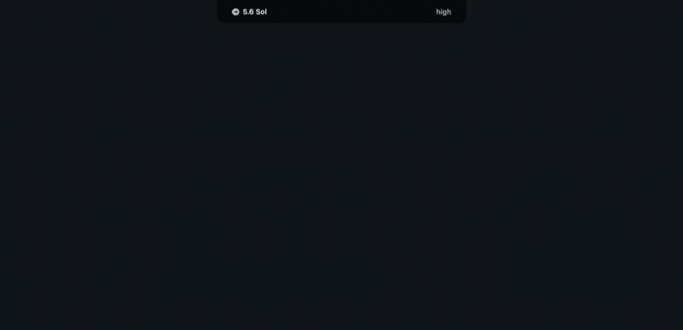
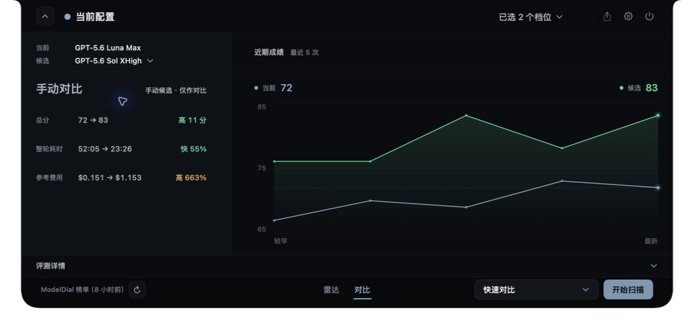
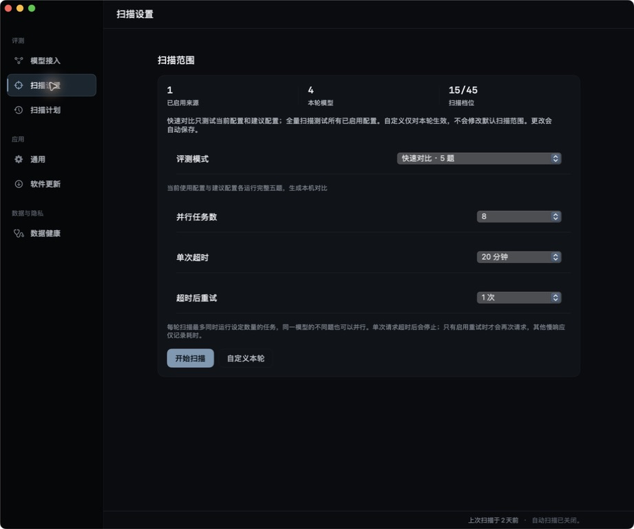

<div align="center">
  
  <h1>ModelDial</h1>
  <p><strong>用真实 coding 评测，选出更适合当前任务的模型配置。</strong></p>
  <p>比较完整的 <code>model + effort + route</code>，直接看到质量、速度、Token 与参考费用。</p>
  <p>
    <a href="https://github.com/tianwdong/modeldial/releases/download/v0.1.0-preview.4/modeldial-0.1.0-preview.4-macos-arm64.dmg"><strong>下载 macOS 预览版</strong></a>
    · <a href="https://modeldial.com">官网</a>
    · <a href="https://modeldial.com/radar">官方 Radar</a>
    · <a href="https://github.com/tianwdong/modeldial">GitHub</a>
    · <a href="README.en.md">English</a>
  </p>
  <p><code>macOS 13+</code> · <code>Apple Silicon</code> · <code>本地优先</code> · <code>无内置遥测</code></p>
</div>

<p align="center">
  
</p>

<p align="center"><em>从菜单栏胶囊进入官方 Radar 和配置对比。演示数据不代表实时榜单结果。</em></p>

## 无需配置，先看官方 Radar

打开 App，点击菜单栏顶部的 ModelDial 胶囊，就能浏览第一方定时评测生成的配置榜单。无需 API Key，不消耗你的模型额度；不安装 App 也可以直接访问 [modeldial.com/radar](https://modeldial.com/radar)。

只有当你想验证自己的 provider、route 或 effort 组合时，才需要接入本机 Codex、Claude Code、Grok Build 或兼容 endpoint，并运行本地评测。官方榜单与本机实测始终是两个明确、可切换的数据来源。

## 下载并安装

**当前版本：[`v0.1.0-preview.4`](https://github.com/tianwdong/modeldial/releases/tag/v0.1.0-preview.4)** · [直接下载 Apple Silicon DMG](https://github.com/tianwdong/modeldial/releases/download/v0.1.0-preview.4/modeldial-0.1.0-preview.4-macos-arm64.dmg)

系统要求：macOS 13 或更高版本、Apple Silicon。Intel Mac 当前不支持。

1. 打开 DMG，把 `modeldial.app` 拖到 `Applications`，推出 DMG 后从 `Applications` 启动。
2. 点击菜单栏顶部的 ModelDial 胶囊，直接浏览官方 Radar；无需先接入模型或运行扫描。
3. 如需自己的对比证据，再进入「评测 → 模型接入」，导入 provider 或新增兼容 endpoint。

> [!IMPORTANT]
> `v0.1.0-preview.4` 是 unsigned／unnotarized 预览包，没有 Developer ID 签名或 Apple notarization。若 macOS 阻止首次打开，请前往“系统设置 → 隐私与安全性 → 仍要打开”确认该 App；不要关闭 Gatekeeper，也不要使用 `xattr`、`spctl` 或其他命令绕过系统安全检查。

> [!NOTE]
> 该预览版已内置官方 Radar 数据地址，但不启用自动更新。后续版本请从本页或同一 GitHub Release 手动下载。若要校验文件，请同时下载 `SHA256SUMS`，并在资产目录运行 `shasum -a 256 -c SHA256SUMS`。

## 它解决什么

- **比较配置，不只比较模型名：** 记录完整的 model、effort、route 和 provider 身份，避免把不同运行方式混成一个结果。
- **把取舍放在同一张证据里：** 同时展示质量、耗时、Token、参考费用、失败状态和题目级结果。
- **固定可复现的比较范围：** 用版本化题包和 evaluation profile 控制题数、超时、并行度与重试。
- **联系正在进行的 coding 会话：** 观察本机 Codex、Claude Code 和 Grok Build 的当前模型状态，再对照 Radar 与本机结果。
- **保留清晰的数据来源：** 官方 Radar 用于快速参考；本机评测用于验证你自己的配置，两者不会悄悄混合。

## 产品界面

<table>
  <tr>
    <td width="50%"></td>
    <td width="50%"></td>
  </tr>
  <tr>
    <td><strong>配置对比</strong><br>查看当前配置与候选配置在质量、耗时、Token 和参考费用上的差异。</td>
    <td><strong>扫描策略</strong><br>设置题数、并行度、超时与重试，再运行可重复评测。</td>
  </tr>
</table>

## 本地评测如何工作

1. **连接模型。** 导入本机 Codex、Claude Code、Grok Build provider，或配置兼容 endpoint。
2. **选择评测范围。** [`questions/catalog.json`](questions/catalog.json) 是版本化题包和 profile 的权威入口。
3. **运行并保留证据。** App 按题数、并行度、超时和重试设置执行评测，并保存质量、耗时、Token、参考费用与失败原因。
4. **做出配置选择。** 在 Radar、对比和历史中回看结果，也可以导出榜单图像。

macOS 原生菜单栏 App 是唯一产品运行入口；仓库中的 scanner、脚本和冻结后端由 App 或构建流程调用。

## 隐私边界

- 配置、扫描历史、运行状态和有限的会话元数据保存在本机。
- API Key 保存在 macOS Keychain，不会写入扫描历史。
- 评测题目和模型回复只会经过你选择的本地 CLI 或模型服务；这些服务各自适用其条款和隐私政策。
- App 不内置遥测，也不上传会话正文或本机评测结果。品牌预览包只读取公开的第一方 Radar 快照；源码构建只有显式配置兼容的快照地址时才会访问远端榜单。

更多边界见 [PRIVACY.md](PRIVACY.md) 和 [公开架构边界](docs/architecture.md)。官网、Cloudflare Worker、远端评测运行器和快照发布服务不属于本仓库，也不是 App 的运行入口。

## 从源码构建

源码构建面向 macOS 13+ Apple Silicon，需要 Xcode 16.4。首次运行 `build.sh` 会把锁定的 Python runtime 解包到被忽略的 `build/` 目录，无需另行安装 Python。

构建输入由 [`python-runtime.lock.json`](build-support/python-runtime.lock.json) 固定为 Python 3.14.3，并由 [`pyinstaller-requirements.txt`](build-support/pyinstaller-requirements.txt) 固定 PyInstaller 6.21.0 及其依赖。

```bash
MODELDIAL_REFERENCE_SNAPSHOT_URL=https://reference.modeldial.com/reference-snapshots ./build.sh
open build/modeldial-candidate.app
```

上面的命令启用官方 Radar。若只需要完全离线的源码构建，直接运行 `./build.sh`；远端参考快照地址默认为空。

`build.sh` 会构建 Swift App、冻结 Python 后端并运行 snapshot smoke。完成过一次完整构建后，只修改 Swift 或资源时可以使用 `./build-dev.sh`；修改 `scanner/`、`scripts/` 或 `questions/` 后必须重新运行 `./build.sh`。完整供应链门禁见 [发布清单](docs/release-checklist.md)。

<details>
<summary>移除从源码安装的会话观察 hook</summary>

以下命令只移除 ModelDial 自己的 Codex／Claude Code hook 和 helper，其他 hook 会保留：

```bash
python3 scripts/install_session_observer.py --uninstall
```

</details>

## 开发与测试

```bash
python3 -m unittest discover -s tests -v
python3 -m unittest tests.test_architecture_baseline -v
git diff --check
```

第二条命令用于版本化 DTO 或架构合同改动；其他改动先运行最小相关测试，再按风险补全量回归。

## 文档

- [公开架构边界](docs/architecture.md)：App、scanner 与私有服务的职责边界。
- [Benchmark 与数据发布策略](docs/benchmark-and-data-policy.md)：题包、答案 fixture、价格快照和 provider 资产。
- [公开内容来源审计](docs/open-source-content-audit.md)：上游来源、attribution 和题包检索留痕。
- [发布清单](docs/release-checklist.md)：源码候选和二进制发行的独立门槛。
- [当前预览发布说明](docs/releases/v0.1.0-preview.4.md)：安装步骤、验证与限制。
- [安全策略](SECURITY.md)：私密漏洞报告渠道。

## 参与贡献与许可证

提交改动前请阅读 [CONTRIBUTING.md](CONTRIBUTING.md)。源代码使用 [Apache License 2.0](LICENSE)。ModelDial 名称、Logo 和 App 图标是品牌资产，不随源代码许可证授权，详情见 [TRADEMARKS.md](TRADEMARKS.md)。随 App 分发的第三方声明见 [NOTICE](NOTICE) 与 [Resources/Legal](Resources/Legal)。
