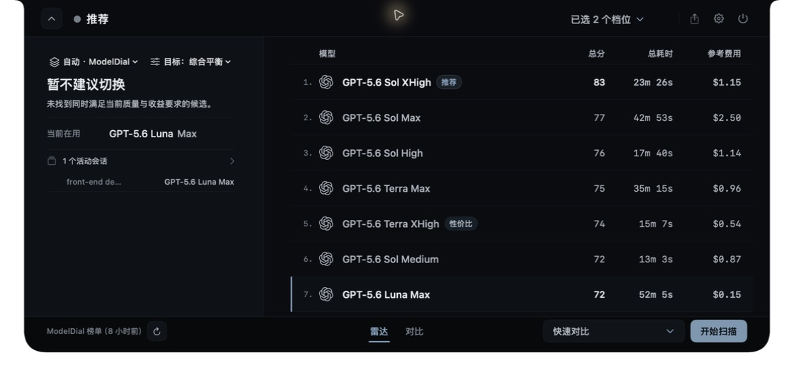

# ModelDial

[English README](README.en.md)

ModelDial 是一个本地优先的 macOS 菜单栏 App。它用真实的 `model + effort + route` 组合完成可重复的 coding 评测，保留质量、耗时、Token 和参考费用证据，帮助你为不同任务选择合适的模型配置。

> 当前仓库是可审计的公开源码候选；目前没有正式下载包，默认构建使用 ad-hoc 签名。

## 官网与正式安装

- 产品官网：<https://modeldial.com>
- 首个正式 DMG 尚未发布。发布后将从 GitHub Releases 下载；打开 DMG 后把 ModelDial 拖入 Applications，再从 Applications 首次启动。
- 首个正式版本支持 macOS 13+ Apple Silicon；Intel Mac 暂不支持。

## 产品预览



*示例数据，不代表实时榜单结果。*

- [对比页：当前配置与候选配置](docs/screenshots/modeldial-compare-zh.jpg)
- [扫描设置：题数、并行度、超时与重试](docs/screenshots/modeldial-settings-scan-zh.jpg)
- [通用设置：语言与启动偏好](docs/screenshots/modeldial-settings-general-zh.jpg)

## 核心能力与真实工作流

- 用真实的 `model + effort + route` 组合比较不同 coding 配置，而不是只比较模型名称。
- 版本化题包和评测 profile 的权威入口是 [`questions/catalog.json`](questions/catalog.json)；当前 `quick` 与 `full` 都覆盖全部启用题。
- 保存质量、耗时、Token、参考费用、失败原因和题目级证据，支持 Radar、对比、历史和结果导出。
- 支持 Codex、Claude Code、Grok Build 的本机会话观察，以及配置兼容的模型 endpoint。
- 本地优先：不内置遥测，不上传会话正文；官网、Cloudflare Worker、远端评测运行器和快照发布服务不属于本仓库，也不是 App 的运行入口。

首次使用时，启动 App 后从菜单栏图标打开设置，进入“评测 → 模型接入”（英文为 “Evaluation → Connections”），导入本机 provider 或新增 endpoint；然后选择 `quick` 或 `full` profile，运行扫描并查看 Radar、对比页和历史记录。

若曾从源码安装 Codex／Claude Code 会话观察 hook，可用以下命令只移除 ModelDial 自己的 hook 和 helper；其他 hook 会保留：

```bash
python3 scripts/install_session_observer.py --uninstall
```

产品唯一运行入口是 macOS 原生菜单栏 App。仓库中的其他脚本和后端模块由 App 或构建脚本调用，不作为独立产品入口。

## 构建与运行

源码构建面向 macOS 13+ Apple Silicon，需要 Xcode 16.4，无需另行安装独立 Python runtime。首次运行 `build.sh` 会按 [`python-runtime.lock.json`](build-support/python-runtime.lock.json) 下载 python.org 官方 universal2 Python 3.14.3 installer，在校验固定 SHA-256 和 Python Software Foundation installer 签名后，仅解包到被忽略的 `build/` 目录；不会执行系统安装，也不会回退到 Homebrew／PATH 中的 Python。随后脚本会在 `build/pyinstaller-env` 中按 [`pyinstaller-requirements.txt`](build-support/pyinstaller-requirements.txt) 精确锁定 PyInstaller 6.21.0、certifi CA bundle 及其构建依赖，并在签名前真实加载 TLS／SHA-256／zstd、确认 CA store 非空，再递归拒绝最低系统版本高于 App 声明或引用非系统绝对动态库路径的 Mach-O。该门禁不能替代 macOS 13／14 干净机器验收；PyPI artifact hashes、正式 SBOM 和完整许可证清单仍是独立发布门槛。首次构建也会由 SwiftPM 按 `Package.resolved` 下载固定版本的 Sparkle 2.9.4。

```bash
./build.sh
open build/modeldial-candidate.app
```

`build.sh` 会构建 Swift App、冻结 Python 后端、运行 snapshot smoke，并校验整包签名。它始终保留 `build/modeldial.app`，默认把新构建写入 `build/modeldial-candidate.app`；若该 candidate 正在运行，则改用带时间戳的 candidate 路径。请以脚本最后输出的路径为准。App 是菜单栏程序，启动后从菜单栏图标打开。

公开源码构建默认使用 ad-hoc 签名；若本机有可用的代码签名身份，可显式传入：

```bash
MODELDIAL_CODESIGN_IDENTITY="Developer ID Application: ..." ./build.sh
```

只修改 Swift 或资源、且已经运行过一次完整构建时，可以使用：

```bash
./build-dev.sh
```

`build-dev.sh` 优先复用 `build/modeldial-candidate.app` 中冻结的 Python 后端；若 candidate 不存在，则兼容复用 `build/modeldial.app`。修改 `scanner/`、`scripts/` 或 `questions/` 后必须重新运行 `./build.sh`。

源码构建默认不配置远端参考快照，因此本地评测不依赖官网或 Cloudflare。只有在拥有真实且兼容的公开快照地址时，才设置 `MODELDIAL_REFERENCE_SNAPSHOT_URL`；协议说明见 [`docs/architecture.md`](docs/architecture.md)。

## 测试

完整 Python 回归：

```bash
python3 -m unittest discover -s tests -v
```

修改版本化 DTO 或架构合同时，可额外运行定向回归：

```bash
python3 -m unittest tests.test_architecture_baseline -v
```

提交前检查差异格式：

```bash
git diff --check
```

## 文档

- [公开架构边界](docs/architecture.md)：App、scanner 与私有服务的职责边界。
- [Benchmark 与数据发布策略](docs/benchmark-and-data-policy.md)：题包、答案 fixture、价格快照和 provider 资产的公开口径。
- [公开内容来源审计](docs/open-source-content-audit.md)：上游来源、attribution 和题包检索留痕。
- [发布清单](docs/release-checklist.md)：源码候选和二进制发行的独立门槛。
- [贡献指南](CONTRIBUTING.md)：代码边界和最小验证要求。

## 数据与网络边界

配置、扫描历史、运行状态和有限的会话元数据保存在本机；API Key 保存在 macOS Keychain。运行评测时，合成题目和模型回复会经过你选择的本地 CLI 或模型服务，具体数据处理仍受对应服务条款约束。App 不上传会话正文，也不把凭据写入扫描历史。

源码构建不默认读取远端参考榜单；需要时由调用方显式配置兼容的快照地址。隐私细节见 [PRIVACY.md](PRIVACY.md)，安全问题请按 [SECURITY.md](SECURITY.md) 的私密渠道报告。

## 参与贡献与许可证

提交改动前请阅读 [CONTRIBUTING.md](CONTRIBUTING.md)。源代码使用 [Apache License 2.0](LICENSE)。ModelDial 名称、Logo 和 App 图标是品牌资产，不随源代码许可证授权，详情见 [TRADEMARKS.md](TRADEMARKS.md)。随 App 分发的第三方声明位于 [NOTICE](NOTICE)、[Resources/Legal/THIRD_PARTY_NOTICES.txt](Resources/Legal/THIRD_PARTY_NOTICES.txt) 和 [Resources/Legal/Sparkle-LICENSE.txt](Resources/Legal/Sparkle-LICENSE.txt)。
